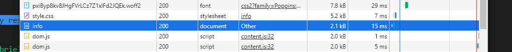
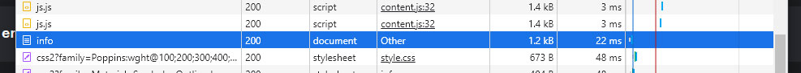
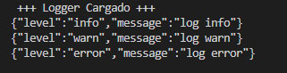
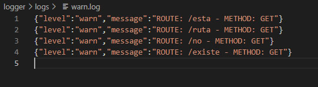
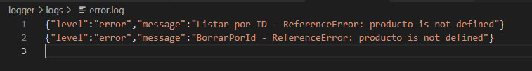
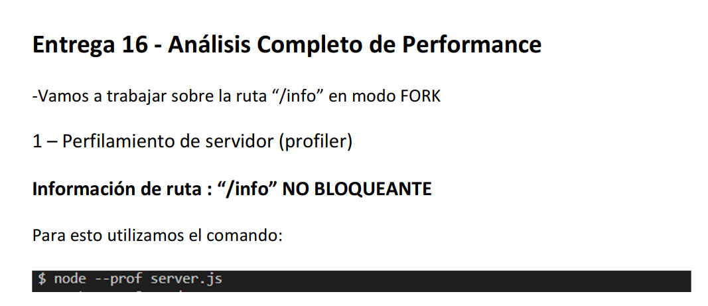

# Logger, Gzip y Analisis de Performance

  

**Entrega 16 - Coder House - Backend Node.js**

  

**Logs, debug y profiling**

  


  

## Iniciar 🐱‍🏍

  

Para iniciar el servidor, primero instalar las dependencias

```
npm install
```

  

luego podemos iniciar el server

  

```
node start --p PUERTO --m MODO
```
O
```
node server.js --p PUERTO --m MODO
```

  

## Descripción 📑

  

El proyecto consta de las siguientes consignas:

  

**Consigna 1 - 📣**

  

Incorporar al proyecto de servidor de trabajo la compresión gzip.

  

Verificar sobre la ruta /info con y sin compresión, la diferencia de cantidad de bytes devueltos en un caso y otro.

  

🎯 **Solucion**

  

Simplemente se agrega el middelware "compression()" a la ruta

  

Tamaño SIN compression

  



  

Tamaño con Compression

  



  

Se puede notar una compresion casi de la mitad del archivo "info"

  

**Consigna 2 - 📣**

  

implementar loggueo (con alguna librería vista en clase) que registre lo siguiente

**Consigna 2-A 📣**

- Ruta y método de todas las peticiones recibidas por el servidor (info).
Loggear todos los niveles a consola **(info, warning y error)**

🎯 **Solucion**



**Consigna 2-B 📣**

- Ruta y método de las peticiones a rutas inexistentes en el servidor (warning)
Registrar sólo los logs de **warning** a un archivo llamada **warn.log**

🎯 **Solucion**



**Consigna 2-C 📣**

- Errores lanzados por las apis de mensajes y productos, únicamente (error).
Enviar sólo los logs de **error** a un archivo llamada **error.log**

🎯 **Solucion**

Reemplazo el Console.log anterior, por el nuevo Logger


Fuerzo errores, para ver que loggea correctamente

  

**Consigna 3 - 📣**


Realizar un informe en formato pdf sobre las pruebas realizadas incluyendo los resultados de todos los test (texto e imágenes).

🎯 **Solucion**

  

🔗LINK:  [Performance.pdf](./performance/performance.pdf)

  

## Tecnologías 💾

  

En este proyectos, se utilizaron distintas tecnologías:

  

- Node.js : entorno de tiempo de ejecución - RTE.

  

- Express.js: framework para Node y manejo de rutas.

  

- http y socket.io: para la interacción del chat.

  

- faker-js: para realizar mocks de datos.

  

- normalizr: necesario para normalizar los datos.

  

- moongose: realiza la conexión con la base de datos mongodb.

  

- mongodb: para la persistencia de datos.

  

- express-session: para manejar las sessiones

  

- Mongo Atlas: para la persistencia de datos en la nube.

  

- EJS: como motor de plantillas.

  

- bCrypt: como api de encriptación.

  

- passport: para la gestión de autenticaciones.

  

- passport-local: como estrategia local junto con passport.

  

- dotenv : libreria necesaria para cargar al process las variables del archivo .env

  

- minimalist : permite gestionar los argumentos pasados a la ejecucion del servidor

  

- cluster : es un modulo de Node, que nos permite crear copias del servidor para delegar carga a cada procesador.

  

- forever : es un modulo que nos permite correr nuestro servidor y actualizarlo sin necesidad de recargar (parecido a nodemon, pero para produccion)

  

- PM2 : es un gestor de procesos, el cual nos permite dentro de sus funcionalidad clustear nuestro servidor de forma automatica.

  

- Nginx: es un servidor web, como apache pero con mas funcionalidades, en este caso lo utilizamos como proxy

  

**NUEVAS**

  

-  **compression**: librería para comprimir contenido antes de enviarlo al cliente.

  

-  **winston**: es un modulo que permite loggear de manera asincronica, tanto en consola como en archivos.

  

-  **artillery**: es una herramienta que permite realizar pruebas de carga de nuestra aplicaciones

  

-  **autocannon**: es otra herramienta de prueba de cargas para aplicaciones y servidores.

  

## Que aprendí ? 💡

  

Conocimientos adquiridos en el modulo entero.

**Tips de Optimización**:

 1. Utilizar compresión: disminuir el tamaño de la respuesta.
 2. **NO** utilizar funciones **SINCRONICAS**: las mismas retrasan los otros procesos de la aplicación.
 3. Utilizar un logger: son asincronicos y permiten registrar los errores.
 4. Manejar excepciones: evita que se detenga la aplicacion. Try/Catch o Promises.
 5. Establecer Node_env en produccion
 6. Reiniciar la aplicación de manera automática: utilizando un gestor.
 7. Cluster: aprobechar al maximo los nucleos del procesador
 8. Cache: almacenar en cache los resultados
 9. Balancear carga: utilizar un gestor para el balanceo como lo es nginx.
 10. Proxy: utilizar un proxy inverso para el manejo de solicitudes 

**Gzip:**
 Herramienta para comprimir una respuesta antes de enviársela al cliente.

**Logger:**
Nos permiten la detección de problemas en el código y un registro fácil de estos.

 - Log4js
 - Winston
 - Pino

Cada uno cuenta con distintos "niveles de loggeo"
*Silly, Debug, Verbose, Info, Warn, Error*
tambien de configuracion, pero mi preferencia fue con **Winston**.

**Test de Carga**

Son herramientas que sirven para "reventar" al sistema con peticiones y generar reportes estadisticos de rendimiento

 - ***Artillery:*** artillery quick --count 50 -n 40
 - ***Autocannon:*** es otra herramienta que se ejecuta desde un archivo, ya no desde consola.
 
 **Profiling**
 
 Es el analisis del rendimiento, a partir de la recoleccion de los datos.
 El proceso seria de esta manera:
 RECOLECCION DE DATOS -> ANALISIS -> GRAFICADO
 
 - ***Curl:*** es una herramienta de recoleccion de datos
 - ***Built-in profiller:*** node --prof y luego node --prof-process.
 - ***Inspect:*** node -inspect . Nos habilita el inspector en DevTools

**Graficador**

Son herramientas que nos permiten representar los datos de manera grafica

 - ***0x:*** zero ex, es una herramientra de graficos de flama
 
Como conclusión final, observamos que tan dañinas al rendimiento pueden ser las funciones sincrónicas, en desarrollo son solo milisegundos, pero en gran escala, pueden ser segundos muy valiosos.

⚡ **Author : Teresczuk Gabriel**