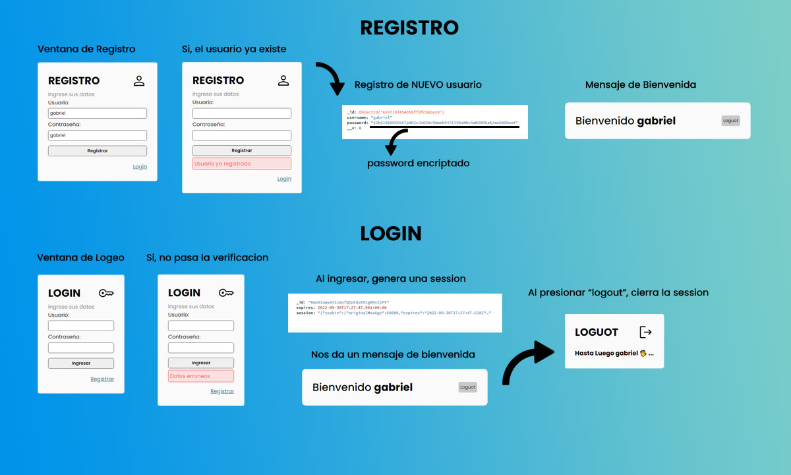

  

# INICIO DE SESION

  

**Entrega 13 - Coder House - Backend Node.js**

  

***Autorización y Autenticación***

  

  

  

  

## Iniciar 🐱‍🏍

  

Para iniciar el servidor, primero instalar las dependencias

  
  

	npm install

  

  

luego podemos iniciar el server

  

  

	node start

  

O

  

	node server.js

  

  

## Descripción 📑

  

El proyecto consta de las siguientes consignas:

  

  

 1. Crear un formulario de Registro.
	
	 a. Guardar la información en la base de datos
	 b. Si el usuario ya esta registrado, mostrar una vista de error.
	 
 2. Crear un formulario de login.
	 a. Comprar los datos, con los de la base de datos
	 b. Si el usuario ya existe, mostrar una vista de error

  

2. Al enviar el formulario, se crea la session, si la session esta creada, no ingresa al login.

  

3. Consumir la session y mostrar el nombre del usuario en la cabecera junto al botón de logout.

  

4. Al presionar logout, destruir la session.

  

5. Mostrar una vista de 2 segundos, con un mensaje de despedida.

  

6. Si no existe una session o esta ya venció, el usuario será direccionado al login.

  

7.  **Persistencia de datos**: Mongo Atlas.

  

  

  

## Tecnologías 💾

  

En este proyectos, se utilizaron distintas tecnologías:

  

  

- Node.js : entorno de tiempo de ejecución - RTE.

  

- Express.js: framework para Node y manejo de rutas.

  

- http y socket.io: para la interacción del chat.

  

- faker-js: para realizar mocks de datos.

  

- normalizr: necesario para normalizar los datos.

  

- moongose: realiza la conexión con la base de datos mongodb.

  

- mongodb: para la persistencia de datos.

  

-  express-session: para manejar las sessiones

  

-  Mongo Atlas: para la persistencia de datos en la nube.
- **EJS**: como motor de plantillas.
- **bCrypt**: como api de encriptación.
- **passport**: para la gestión de autenticaciones.
- **passport-local**: como estrategia local junto con passport.

  

## Que aprendí ? 💡

  

Conocimientos adquiridos en el modulo entero.

  

- Diferencias entre AUTENTICACION y AUTORIZACION

	-  **Autenticación** -> identifica al usuario.

	-  **Autorización** -> define el acceso a los servicios y recursos.

- Distintos metodos de autenticacion:

	- Usuario y contraseña.

	- Passwordless.

	- Redes Sociales: twitter, facebook, google, etc.

	- Datos biométricos.

	- Json Web Token (jwt)

	- Oauth