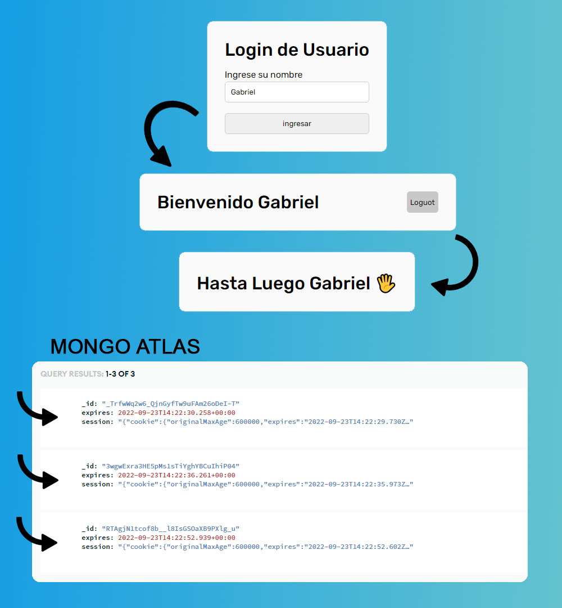


# LOG-IN POR FORMULARIO

**Entrega 12 - Coder House - Backend Node.js**

***Cookies Session y Storage***

  

  

## Iniciar 🐱‍🏍

Para iniciar el servidor, primero instalar las dependencias

	npm install

  

luego podemos iniciar el server

  

	node start

	O

	node server.js

  

## Descripción 📑

El proyecto consta de las siguientes consignas:

  

1. Crear un formulario de login.

2. Al enviar el formulario, se crea la session, si la session esta creada, no ingresa al login.

3. Consumir la session y mostrar el nombre del usuario en la cabecera junto al botón de logout.

4. Al presionar logout, destruir la session.

5. Mostrar una vista de 2 segundos, con un mensaje de despedida.

6. Si no existe una session o esta ya venció, el usuario será direccionado al login.

7.  **Persistencia de datos**: Mongo Atlas.

8.  **Extra**: la session se va a restaurar con cada interacción (session -> 'rolling').

  

## Tecnologías 💾

En este proyectos, se utilizaron distintas tecnologías:

  

- Node.js : entorno de tiempo de ejecución - RTE.

- Express.js: framework para Node y manejo de rutas.

- http y socket.io: para la interaccion del chat.

- faker-js: para realizar mocks de datos.

- normalizr: necesario para normalizar los datos.

- moongose: realiza la conexión con la base de datos mongodb.

- mongodb: para la persistencia de datos.

-  **express-session**: para manejar las sessiones

-  **Mongo Atlas**: para la persistencia de datos en la nube.

## Que aprendí ? 💡

Conocimientos adquiridos en el modulo entero.

 - Diferencias entre COOKIES y SESSIONES
   - **Cookies** -> Lado del Cliente
   - **Session** -> Lado del Servidor
 - Ambas se pueden:
   - Leer
   - Borrar (destoy)
   - Firmar (signed)  
  - Las sessiones pueden **Guardarse** o almacenarse:
    - En Memoria => express-session
    - En Archivos => session-file-store
    - Diccionario Remoto => Redis/RedisLab
    - Mongo/MongoAtlas => connect-mongo

