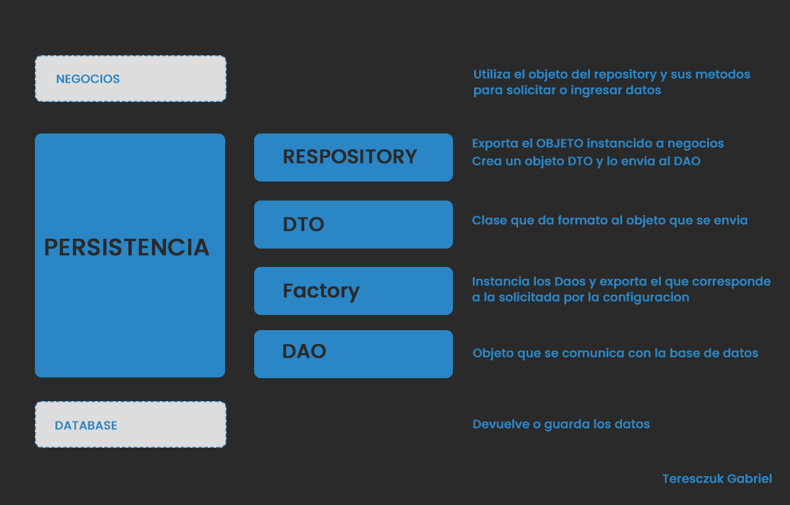
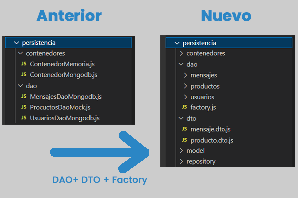
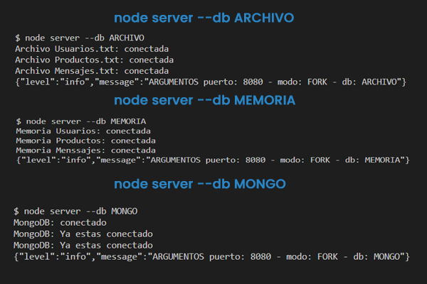
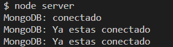
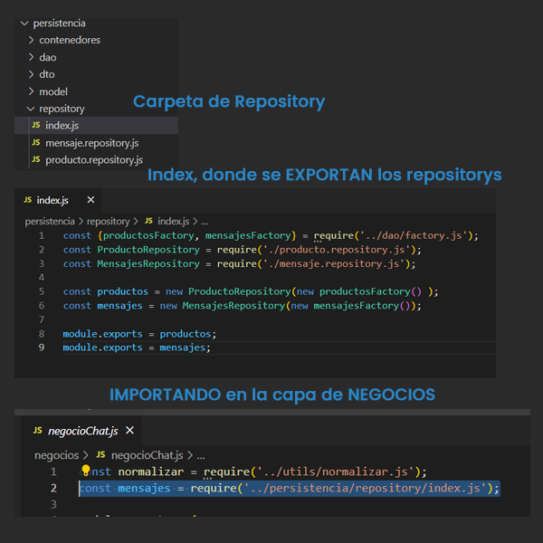

# MEJORAR LA ARQUITECTURA DE NUESTRA API

**Entrega 20 - Coder House - Backend Node.js**

**Mejorar la arquitectura de nuestra API**



## Iniciar 🐱‍🏍

Para iniciar el servidor, primero instalar las dependencias

```
npm install
```

luego podemos iniciar el server

```
node start --p PUERTO --m MODO --db DATABASE
```

O

```
node server.js --p PUERTO --m MODO --db DATABASE
```

## Descripción 📑

El proyecto consta de las siguientes consignas:

**Consigna 1 - 📣**

➔ Modificar la capa de persistencia incorporando los conceptos de Factory, DAO, y DTO.

➔ Los DAOs deben presentar la misma interfaz hacia la lógica de negocio de nuestro servidor.

🎯 **Solución**



Se creo un **DAO** nuevo por cada tipo de conexión
Se incorporaron TODO los daos en el **Factory**
Se crearon y testearon todos los **DTOs**

**Consigna 2 - 📣**

➔ El DAO seleccionado (por un parámetro en línea de comandos como lo hicimos anteriormente) será devuelto por una Factory para que la capa de negocio opere con el.

🎯 **Solución**



Se agrego a la lista de parametros, un tercero, que se carga el como "--db DATABASE", el parámetro puede ser "MONGO/ARCHIVO/MEMORIA", por defecto, si no se elige alguno, selecciona MONGO.

**Consigna 3 - 📣**

➔ Cada uno de estos casos de persistencia, deberán ser implementados usando el patrón singleton que impida crear nuevas instancias de estos mecanismos de acceso a los datos.

➔ Comprobar que si llamo a la factory dos veces, con una misma opción elegida, devuelva la misma instancia.

🎯 **Solución**



Se utiliza el patrón singleton y se intenta crear la mismo conexión a mongo ahora emitiendo un mensaje de que ya se encuentra conectado.

**Consigna 4- 📣**

➔ Implementar el patrón Repository para la persistencia de productos y mensajes.

🎯 **Solución**



Se realizo el repository, que instancia los DTOs y los DAOs y exporta un objeto listo para ser usando en la capa de negocios

## Que aprendí ? 💡

- Aprendí a usar diferentes tipos de patrones.

  -- use mucho el **IIFE** para realizar los test en cada etapa
  
  -- use el patrón **singleton** para la conexión de la base de datos
- Entendi de mejor manera el uso del **DAO**
- Como hacer para exportar de manera facil con el metodo **Factory**
- A crear un **modelo** para definir el DAO
- Como dar formato a un objeto de dato con **DTO**
- Utilizar un DTO y un DAO para crear un repositorio
- Y con todo esto abstraer mas la capa de persistencia en pequeñas piezas que se unen para lograr el flujo de datos.

## Tecnologías 💾

En este proyectos, se utilizaron distintas tecnologías:

- Node.js : entorno de tiempo de ejecución - RTE.

- Express.js: framework para Node y manejo de rutas.

- http y socket.io: para la interacción del chat.

- faker-js: para realizar mocks de datos.

- normalizr: necesario para normalizar los datos.

- moongose: realiza la conexión con la base de datos mongodb.

- mongodb: para la persistencia de datos.

- express-session: para manejar las sessiones

- Mongo Atlas: para la persistencia de datos en la nube.

- EJS: como motor de plantillas.

- bCrypt: como api de encriptación.

- passport: para la gestión de autenticaciones.

- passport-local: como estrategia local junto con passport.

- dotenv : libreria necesaria para cargar al process las variables del archivo .env

- minimalist : permite gestionar los argumentos pasados a la ejecucion del servidor

- cluster : es un modulo de Node, que nos permite crear copias del servidor para delegar carga a cada procesador.

- forever : es un modulo que nos permite correr nuestro servidor y actualizarlo sin necesidad de recargar (parecido a nodemon, pero para produccion)

- PM2 : es un gestor de procesos, el cual nos permite dentro de sus funcionalidad clustear nuestro servidor de forma automatica.

- Nginx: es un servidor web, como apache pero con mas funcionalidades, en este caso lo utilizamos como proxy

- compression: libreria para comprimir contenido antes de enviarlo al cliente.

- winston: es un modulo que permite loggear de manera asincronica, tanto en consola como en archivos.

- artillery: es una herramienta que permite realizar pruebas de carga de nuestra aplicaciones

- autocannon: es otra herramienta de prueba de cargas para aplicaciones y servidores.

⚡ **Author : Teresczuk Gabriel**
