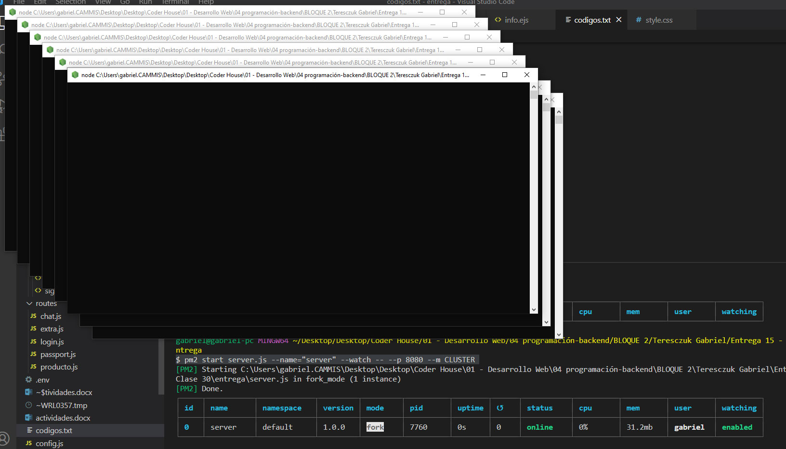

  

# SERVIDOR CON BALANCE DE CARGA

  

  

**Entrega 15 - Coder House - Backend Node.js**

  

  

**Clusters y escalabilidad**

  

  

  


  

  

  

## Iniciar 🐱‍🏍

  

  

Para iniciar el servidor, primero instalar las dependencias

  

  
```
npm install
```
  

  

  

luego podemos iniciar el server

  

  

  
```
node start --p PUERTO --m MODO
```
  

  

O

  

  
```
node server.js --p PUERTO --m MODO
```
  

  

  

## Descripción 📑

  

  

El proyecto consta de las siguientes consignas:

**Consigna 1 - 📣**
Tomando con base el proyecto que vamos realizando, agregar un parámetro más en la ruta de comando que permita ejecutar al servidor en modo fork o cluster. Dicho parámetro será 'FORK' en el primer caso y 'CLUSTER' en el segundo, y de no pasarlo, el servidor iniciará en modo fork.

🎯 **Solucion**
Nuevo parámetro --m  que hace referencia al modo, puede ser (FORK / CLUSTER). Cluster de manera manual con el objeto cluster.
```
$ node server --p 8080 --m FORK
```


```
$ node server --p 8080 --m CLUSTER
```


**Consigna 2 - 📣**
Agregar en la vista info los procesadores presentes

```javascript
const  numCPUs = require('os').cpus().length; // nro de CPUS
```


**Consigna 3 - 📣**
Ejecutar el servidor (modos FORK y CLUSTER) con nodemon verificando el número de procesos tomados por node.
```
$ nodemon server --p 8080 --m FORK
```

  

```
$ nodemon server --p 8080 --m CLUSTER
```

  


**Consigna 4 - 📣**
Ejecutar el servidor (con los parámetros adecuados) utilizando Forever, verificando su correcta operación. Listar los procesos por Forever y por sistema operativo.

```
$ forever start server.js --p 8080 --m FORK
```

   


```
$ forever start server.js --p 8080 --m CLUSTER
```

   
   
   

**Consigna 5 - 📣**
Ejecutar el servidor (con los parámetros adecuados: modo FORK) utilizando PM2 en sus modos modo fork y cluster. Listar los procesos por PM2 y por sistema operativo.

```
$ pm2 start server.js --name="server" --watch -- --p 8080 --m FORK
```
   


```
$ pm2 start server.js --name="server" --watch -- --p 8080 --m CLUSTER
```

   

```
$ pm2 start server.js --name="server" --watch -i max -- --p 8080 --m FORK
```

   

**Consigna 6 - 📣**
NGINX - Redirigir todas las consultas a /api/randoms a un cluster de servidores escuchando en el puerto 8081. El cluster será creado desde node utilizando el módulo nativo cluster.

El resto de las consultas, redirigirlas a un servidor individual escuchando en el puerto 8080.

```
pm2 start server.js --name="server" --watch -- --p 8080 --m FORK

pm2 start server.js --name="server" --watch -- --p 8081 --m CLUSTER
```
   

**Consigna 7 - 📣**
modificar la configuración para que todas las consultas a /api/randoms sean redirigidas a un cluster de servidores gestionado desde nginx, repartiéndolas equitativamente entre 4 instancias escuchando en los puertos 8082, 8083, 8084 y 8085 respectivamente.

```
pm2 start server.js --name="server" --watch -- --p 8080 --m FORK

pm2 start server.js --name="server2" --watch -i max -- --p 8082

pm2 start server.js --name="server3" --watch -i max -- --p 8083

pm2 start server.js --name="server4" --watch -i max -- --p 8084

pm2 start server.js --name="server5" --watch -i max -- --p 8085
```

   


## Tecnologías 💾


En este proyectos, se utilizaron distintas tecnologías:

  

  

  

- Node.js : entorno de tiempo de ejecución - RTE.

  

  

- Express.js: framework para Node y manejo de rutas.

  

  

- http y socket.io: para la interacción del chat.

  

  

- faker-js: para realizar mocks de datos.

  

  

- normalizr: necesario para normalizar los datos.

  

  

- moongose: realiza la conexión con la base de datos mongodb.

  

  

- mongodb: para la persistencia de datos.

  

  

- express-session: para manejar las sessiones

  

  

- Mongo Atlas: para la persistencia de datos en la nube.

- EJS: como motor de plantillas.

- bCrypt: como api de encriptación.

- passport: para la gestión de autenticaciones.

- passport-local: como estrategia local junto con passport.

-  dotenv : libreria necesaria para cargar al process las variables del archivo .env

-  minimalist : permite gestionar los argumentos pasados a la ejecucion del servidor
- **cluster** : es un modulo de Node, que nos permite crear copias del servidor para delegar carga a cada procesador.
- **forever** : es un modulo que nos permite correr nuestro servidor y actualizarlo sin necesidad de recargar (parecido a nodemon, pero para produccion)
- **PM2** : es un gestor de procesos, el cual nos permite dentro de sus funcionalidad clustear nuestro servidor de forma automatica.
- **Nginx**: es un servidor web, como apache pero con mas funcionalidades, en este caso lo utilizamos como proxy

  

  

## Que aprendí ? 💡

  

  

Conocimientos adquiridos en el modulo entero.

**Cluster:**
 el cluster es en si, un **RECURSO**, en este caso los procesadores de la pc, que se pueden usar para diversas tareas.
 
**Node**, ya viene con un modulo de **cluster** que nos permite clonar el WORKER y asi aprobechar varios hilos del procesador.

**Modo fork**, seria la ejecucion normal de un proceso.
**Modo Cluster**, utiliza el modo cluster de node.

**Forever:**
Es un modulo, oyente o watcher,  que permite la gestion del servidor, en el arranque, si surge algun error y tambien nos permite realizar varias instancias y gestionarlas en forma de listas. ( se utiliza en desarrollo)

**PM2:**
De su nombre, es un **Process Manager**, maneja los procesos y los servidores, dentro de sus facilidades tiene el modo cluster, que nos facilita para ejecutar aplicaciones.

**Proxy:**
Funciona de intermediario entre las coneccion, oculta los datos de ambos lados, y sirve como sistema de seguridad,  existen dos tipos:
Proxy Forward, que se coloca entre el cliente y la web
**CLIENTE -> PROXY -> WEB**   => oculta MI IP
Proxy Reverse,  que se coloca entre la web y el servidor
**WEB - > PROXY -> SERVER** => oculta la IP del servidor
Esto tiene 6 beneficios remarcables : 
1 - Balanceo de Carga
2 - Cacheo 
3 - Servicio de proteccion
4 - Compresion de informacion
5 - Cifrado SSL
6 - Monitoreo y registro de todo el trafico

**Nginx:**
Es un servidor web, como lo seria apache, pero este tambien funciona como proxy, lo que nos ayuda en estos casos, a redirigir el trafico y hasta tiene su propio balanceado de carga

⚡ **Author : Teresczuk Gabriel**