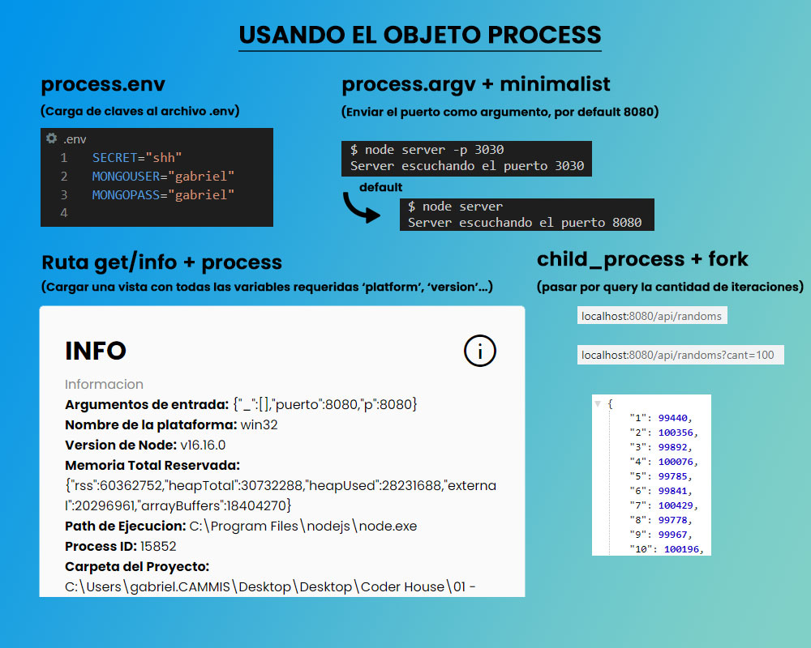

  

# USANDO EL OBJETO PROCESS

  

**Entrega 14 - Coder House - Backend Node.js**

  

***Proceso principal del servidor**

  

  

  

  

## Iniciar 🐱‍🏍

  

Para iniciar el servidor, primero instalar las dependencias

  
  

	npm install

  

  

luego podemos iniciar el server

  

  

	node start

  

O

  

	node server.js

  

  

## Descripción 📑

  

El proyecto consta de las siguientes consignas:

  

  

1. Mover todas las claves al archivo **.env** y cargarla metidante 'dotenv'.
2. Cargar la configuracion del puerto mediante 'argumentos' " node server -p 8080".
3. Crear una vista de info **get('/info')** donde se puedan visualizar las diferentens propiedades del objeto process.
4. Crear una ruta, **api/random?cant=xx**, que acepte un parámetro de 'cant', donde se generen x cantidades de números aleatorios y se agrupen en un objeto según la cantidad de repeticiones.

  

  

  

## Tecnologías 💾

  

En este proyectos, se utilizaron distintas tecnologías:

  

  

- Node.js : entorno de tiempo de ejecución - RTE.

  

- Express.js: framework para Node y manejo de rutas.

  

- http y socket.io: para la interacción del chat.

  

- faker-js: para realizar mocks de datos.

  

- normalizr: necesario para normalizar los datos.

  

- moongose: realiza la conexión con la base de datos mongodb.

  

- mongodb: para la persistencia de datos.

  

-  express-session: para manejar las sessiones

  

-  Mongo Atlas: para la persistencia de datos en la nube.
- EJS: como motor de plantillas.
- bCrypt: como api de encriptación.
- passport: para la gestión de autenticaciones.
- passport-local: como estrategia local junto con passport.
- **dotenv** : libreria necesaria para cargar al process las variables del archivo .env
- **minimalist** : permite gestionar los argumentos pasados a la ejecucion del servidor

  

## Que aprendí ? 💡

  

Conocimientos adquiridos en el modulo entero.

- Pasaje de parametros al servidor
 `node server -p 8080 -s localhost`
- Uso de los parametros con **process.argv**
- Uso de librerias, como **minimist** y **yarns** para gestionar estos argumentos y darles opciones como alias o default.
- variables del entorno de node, con **process.env**
- uso del libreria **dotnev**, con la cual cargamos variables de entorno a nuestra aplicacion node.
- Uso Global de process, para obtener datos del sistema, como process.version
- Funcionalidad de **on('event', callback)**, que escucha un evento, muy parecido a **addEventListener()**.
- Muy importente el uso de **"child process"**
- Diferentes formas de creer el proseso hijo, con :
- **exec()**, ejecuta un comando, es  bloqueante
- **execFile()**, ejecuta un archivo y un comando, es bloqueante
- **spawn()**, mantiene un flujo con el archivo hijo, es bloqueante
- **fork()**, mantiene el flujo entre el padre y el hijo y es NO BLOQUEANTE