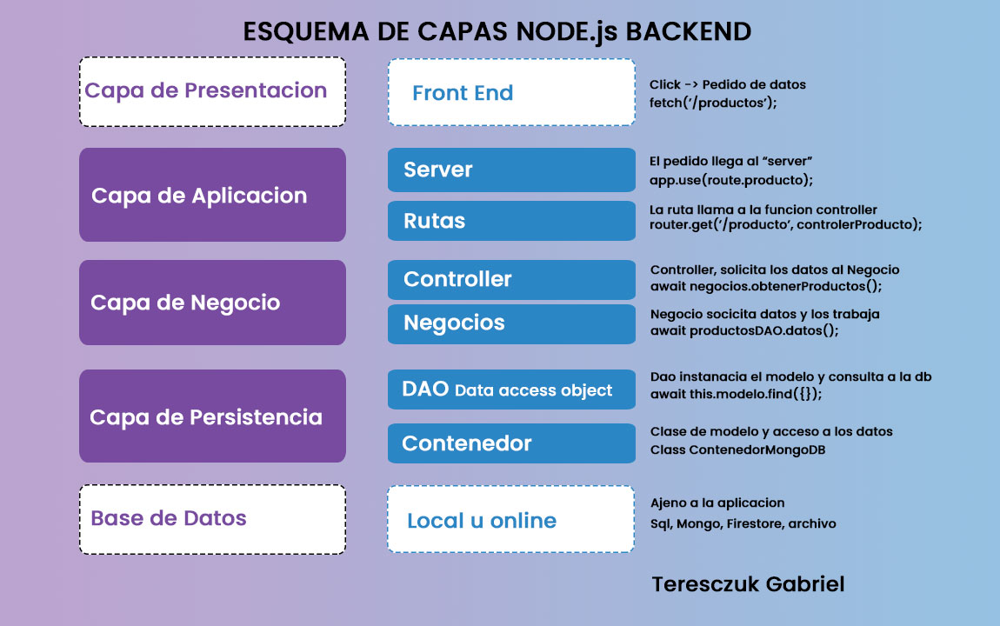
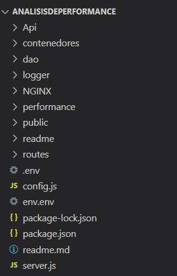
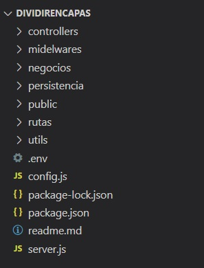


  

# Dividir en capas nuestro Proyecto

  

  

  

**Entrega 19 - Coder House - Backend Node.js**

  

  

  

**Dividir en capas nuestro proyecto**

  

  

  

  



  

  

  

  

## Iniciar 🐱‍🏍

  

  

  

Para iniciar el servidor, primero instalar las dependencias

  

  

```

npm install

```

  

  

  

luego podemos iniciar el server

  

  

  

```

node start --p PUERTO --m MODO

```

  

  

O

  

  

```

node server.js --p PUERTO --m MODO

```

  

  

  

## Descripción 📑

  

  

  

El proyecto consta de las siguientes consignas:

  

**Consigna 1 - 📣**


Dividir en capas el proyecto entregable con el que venimos trabajando (entregable clase 16: loggers y profilers), agrupando apropiadamente las capas de ruteo, controlador, lógica de negocio y persistencia.
  

🎯 **Solucion**

Proyecto ANTES de la re estructuración.



Proyecto DESPUES de la re estructuracion



Luego de la re estructuración se puede notar un gran cambio, en la disminución de las carpetas y un orden en los archivos.
Esto también llevado a la optimización del flujo del proyecto, ahora al realizar un cambio necesario, solo hay que atacar a la capa correspondiente, sin tener un solo archivo sobrepoblado de líneas de código.

## Que aprendí ? 💡

  
**Identificación:**
Aprendí a identificar las capas, por su labor. 
- **Capa de Presentación:** es la capa que ve el usuario.
- **Capa de Aplicación:** crea el servidor y redireciona las rutas.
- **Capa de Negocios:** se encarga de procesar los datos.
- **Capa de Persistencia:** se comunica con la base de datos.

**Alcance**:
Ahora comprendo el alcance de cada capa, hasta donde llega la responsabilidad de cada una
- **Capa de Presentación:** solo puede pedir y enviar datos, no procesa nada.
- **Capa de Aplicación:** puede redirigir y enviar datos.
- **Capa de Negocios:** procesa y envía datos, a aplicación o a persistencia.
- **Capa de Persistencia:** envía o extrae datos de la base.

**Orden:**
La importancia del orden y la organización en el código, sin estos dos, se resuelve en una ensalada de código, donde se llama a objetos y se accede a la base de datos desde cualquier punto.

  


## Tecnologías 💾

  
  
  
  
  

En este proyectos, se utilizaron distintas tecnologías:

  

  

  

  

- Node.js : entorno de tiempo de ejecución - RTE.

  

  

  

- Express.js: framework para Node y manejo de rutas.

  

  

  

- http y socket.io: para la interacción del chat.

  

  

  

- faker-js: para realizar mocks de datos.

  

  

  

- normalizr: necesario para normalizar los datos.

  

  

  

- moongose: realiza la conexión con la base de datos mongodb.

  

  

  

- mongodb: para la persistencia de datos.

  

  

  

- express-session: para manejar las sessiones

  

  

  

- Mongo Atlas: para la persistencia de datos en la nube.

  

- EJS: como motor de plantillas.

  

- bCrypt: como api de encriptación.

  

- passport: para la gestión de autenticaciones.

  

- passport-local: como estrategia local junto con passport.

  

- dotenv : libreria necesaria para cargar al process las variables del archivo .env

  

- minimalist : permite gestionar los argumentos pasados a la ejecucion del servidor

-  cluster : es un modulo de Node, que nos permite crear copias del servidor para delegar carga a cada procesador.

-  forever : es un modulo que nos permite correr nuestro servidor y actualizarlo sin necesidad de recargar (parecido a nodemon, pero para produccion)

-  PM2 : es un gestor de procesos, el cual nos permite dentro de sus funcionalidad clustear nuestro servidor de forma automatica.

-  Nginx: es un servidor web, como apache pero con mas funcionalidades, en este caso lo utilizamos como proxy

  - compression: libreria para comprimir contenido antes de enviarlo al cliente.
  - winston: es un modulo que permite loggear de manera asincronica, tanto en consola como en archivos.
  - artillery: es una herramienta que permite realizar pruebas de carga de nuestra aplicaciones
  - autocannon: es otra herramienta de prueba de cargas para aplicaciones y servidores.
  

  

  


⚡ **Author : Teresczuk Gabriel**