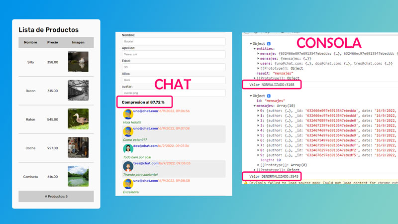

# MOCKS Y NORMALIZACION
**Entrega 11 - Coder House - Backend Node.js**

## Iniciar 🐱‍🏍
Para iniciar el servidor, primero instalar las dependencias

    npm install

luego podemos inciar el server

    node start 
    O
    node server.js

## Descripcion 📑
El proyecto consta de las siguientes consignas:

 1. Generar una lista de productos con Faker-js a modo de Mock
 2. Consumir este mock desde el cliente frontend
 3. Agregar nuevos campos al sistema de chat
 4. Guardar la informacion en una base de datos persistente
 5. Recuperar esta informacion, 'normalizarla' y enviarla al frontend
 6. En el frontend, 'denormalizarla', montarla en una plantilla y mostrarla al usaurio
 7. **EXTRA**: mostrar los valores por consola.

## Tecnologias 💾
En este proyectos, se utilizaron distintas tecnologias:

 - Node.js : como servidor.
 - Express.js: como servicio de ruteo.
 - http y socket.io: para la interaccion del chat.
 - faker-js: para realizar mocks de datos.
 - normalizr: necesario para normalizar los datos.
 - moongose: realiza la coneccion con la base de datos mongodb.
 - mongodb: para la persistencia de datos.

