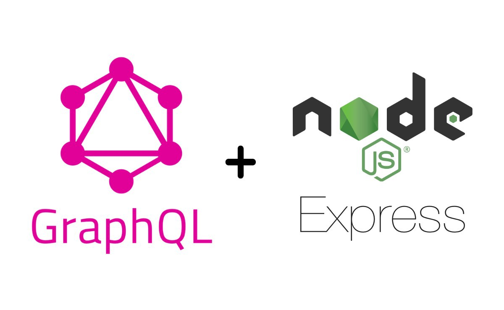
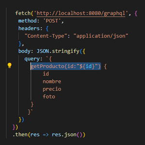

# TESTEAMOS NUESTRA API REST

  

**Entrega 22 - Coder House - Backend Node.js**

  

**Reformar para usar GraphQL**

  



  

## Iniciar 🐱‍🏍

  

Para iniciar el servidor, primero instalar las dependencias

  

```
npm install
```

luego podemos iniciar el server

```
node start --p PUERTO --m MODO --db DATABASE
```

  

O

  

```
node server.js --p PUERTO --m MODO --db DATABASE
```

  

## Descripción 📑

  

El proyecto consta de las siguientes consignas:

  

**Consigna 1 - 📣**

➔ En base al último proyecto entregable de servidor API RESTful, reformar la capa de routeo y el controlador para que los requests puedan ser realizados a través del lenguaje de query GraphQL.


🎯 **Solución**

Se procede a crear el middelware de graphQl , este es graphqlHTTP(), para cada una de las rutas a utilizarse


Cada ruta maneja un controllador, que este devuelve la respuesta de la capa de negocios


**Consigna 2 - 📣**


➔ Si tuviésemos un frontend, reformarlo para soportar GraphQL y poder dialogar apropiadamente con el backend y así realizar las distintas operaciones de pedir, guardar, actualizar y borrar recursos.

  
🎯 **Solución**

Se procede a modificar el Front End, enfocando en los productos y todos los verbos del crud.

Get - ProductosTest


Get - Productos


Get - Producto Por Id



Mutation - Delete Producto


Mutation - Put Producto


Mutation - Post Producto


**Consigna 3 - 📣**


➔ Utilizar GraphiQL para realizar la prueba funcional de los querys y las mutaciones.
  
🎯 **Solución**

Usando el modo de desarrollo, se ingresa a cada una de las rutas, para utulizar la herramienta "GraphiQL"
  
```
npm start
```
Se realizaron las pruebas para cada ruta 

Get - ProductosTest

Get - Productos

Get - Producto Por Id

Mutation - Delete Producto

Mutation - Put Producto

Mutation - Post Producto


  

## Que aprendí ? 💡

En este modulo aprendimos a utilizar el lenguaje **GraphQl** y en conjunto con la herramienta **GraphiQl**, que se puede utilizar para consultar información a modo de api **REST**, pero no reemplazando a la misma, lo bueno de esta tecnología es que puede trabajar de manera conjunta, como lo comprobamos en el desarrollo de este trabajo entregable.

**Lo bueno de esta tecnologia es :**

**Velocidad:** las consultas son simples y rapidas.

**Flexibilidad:** se acopla facilmente al entorno de trabajo.

**Facilidad:** las consultas son faciles de armar y el sistema ayuda a realizarlas.

**Esquemas:** los esquemas nos ayudan a formatear las consultas y a partir de esto, decidir que campos voy a utilizar.

**Documentacion:** La documentación es sencilla y fácil de interpretar.
  


## Tecnologías 💾

  

En este proyectos, se utilizaron distintas tecnologías:

  

- Node.js : entorno de tiempo de ejecución - RTE.

  

- Express.js: framework para Node y manejo de rutas.

  

- http y socket.io: para la interacción del chat.

  

- faker-js: para realizar mocks de datos.

  

- normalizr: necesario para normalizar los datos.

  

- moongose: realiza la conexión con la base de datos mongodb.

  

- mongodb: para la persistencia de datos.

  

- express-session: para manejar las sessiones

  

- Mongo Atlas: para la persistencia de datos en la nube.

  

- EJS: como motor de plantillas.

  

- bCrypt: como api de encriptación.

  

- passport: para la gestión de autenticaciones.

  

- passport-local: como estrategia local junto con passport.

  

- dotenv : libreria necesaria para cargar al process las variables del archivo .env

  

- minimalist : permite gestionar los argumentos pasados a la ejecucion del servidor

  

- cluster : es un modulo de Node, que nos permite crear copias del servidor para delegar carga a cada procesador.

  

- forever : es un modulo que nos permite correr nuestro servidor y actualizarlo sin necesidad de recargar (parecido a nodemon, pero para produccion)

  

- PM2 : es un gestor de procesos, el cual nos permite dentro de sus funcionalidad clustear nuestro servidor de forma automatica.

  

- Nginx: es un servidor web, como apache pero con mas funcionalidades, en este caso lo utilizamos como proxy

  

- compression: libreria para comprimir contenido antes de enviarlo al cliente.

  

- winston: es un modulo que permite loggear de manera asincronica, tanto en consola como en archivos.

  

- artillery: es una herramienta que permite realizar pruebas de carga de nuestra aplicaciones

  

- autocannon: es otra herramienta de prueba de cargas para aplicaciones y servidores.

  

-  Axios: biblioteca de solicitudes .

-  Mocha: framework de pruebas para node.

-  Supertest: prueba solicitudes http.

-  Chai: es una libreria que sirve para comparar valores.

- **express-graphql** : librería que combina la funcionalidad de middelware con graphql
- **graphql** : librería para crear los schemas que utilizara luego realizando las consultas.
  

⚡ **Author : Teresczuk Gabriel**