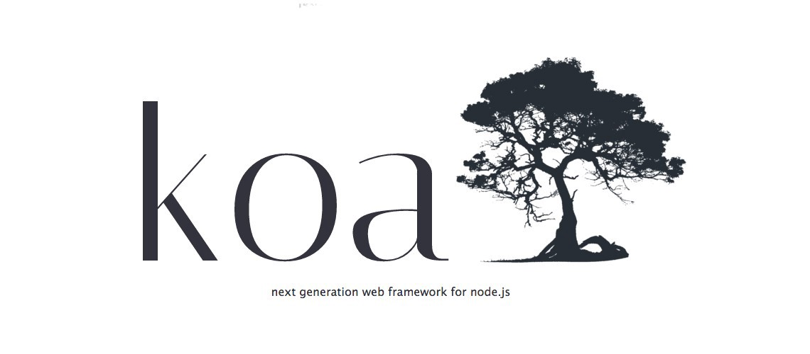
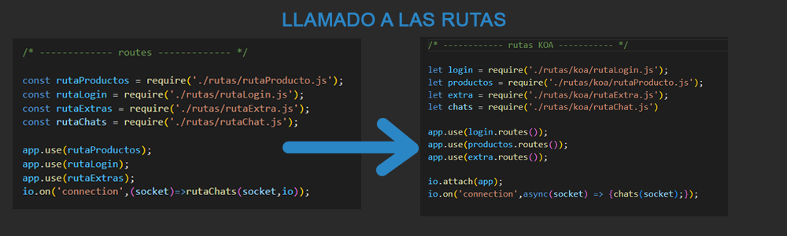
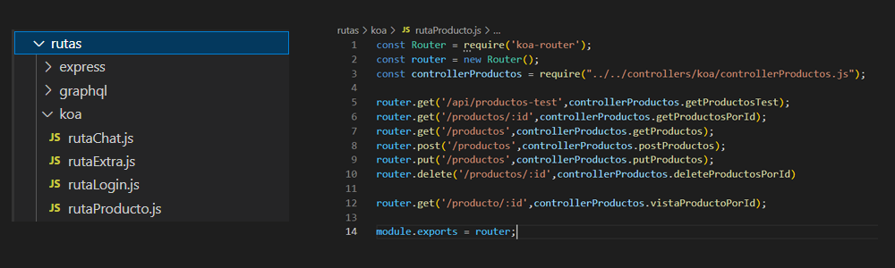
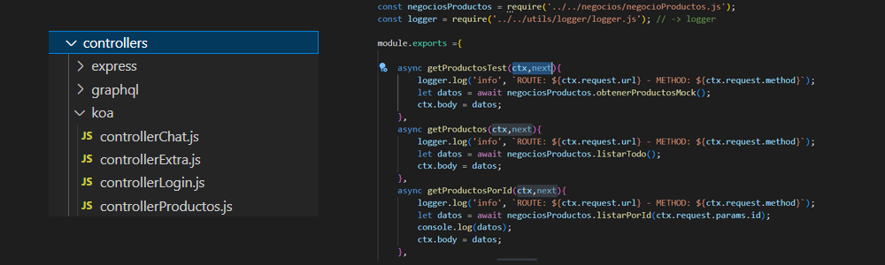
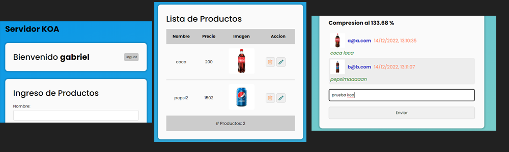
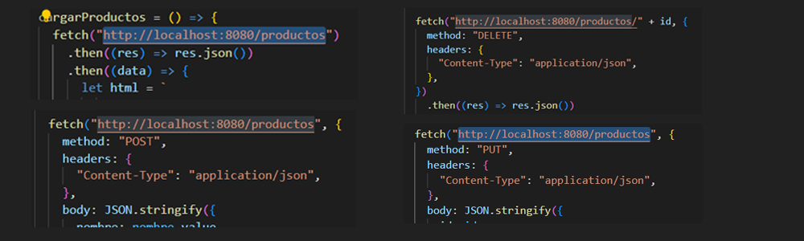
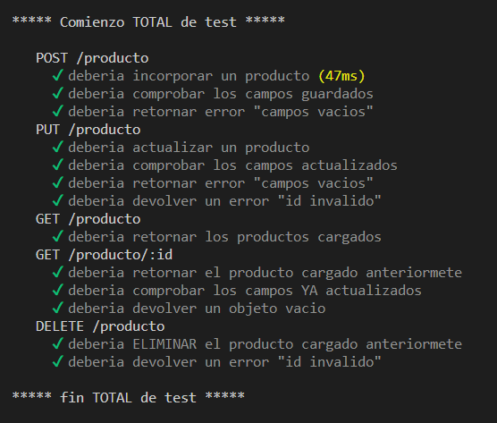

# REFORMAR PARA USAR OTRO FRAMEWORK

**Entrega 23 - Coder House - Backend Node.js**

**Reformar para usar otro Framework**



## Iniciar 🐱‍🏍

Para iniciar el servidor, primero instalar las dependencias

```

npm install

```

luego podemos iniciar el server

```

node start --p PUERTO --m MODO --db DATABASE

```

O

```

node serverkoa.js --p PUERTO --m MODO --db DATABASE

```

## Descripción 📑

El proyecto consta de las siguientes consignas:

**Consigna - 📣**

➔ Elegir uno de los frameworks vistos en clase y trasladar a esta nueva plataforma el último proyecto entregable (con GraphQL) o al anterior (sin GraphQL).

El framework elegido, sera KOA

➔Verificar el correcto funcionamiento del servidor a nivel de sus rutas, vistas, lógica de negocio y persistencia.


🎯 **Solución**


**RUTAS**

Se crean las rutas para KOA



Se crean las rutas nuevas, utilizando la libreria 'koa-router'



**CONTROLLERS**

Se crean los controladores, a diferencia de express, estas utilizan el objeto CTX, que hace referencia la contexto.



**VISTAS**

Se comprueba que las vistas funcionen de manera correcta y se modifican los llamados a las rutas





**TEST**

Se realizaron los test con mocha, para comprobar el funcionamiento correcto.



## Que aprendí ? 💡

En este modulo, hemos aprendido sobre diferentes freameworks, como alternativa a express.

Algunos son mas amigables con diferentes patrones de diseño y otros son de desarrollo rápido a base de templates, pero haciéndolos un poco mas pesados.

Dentro de estos, el que mas me gusto fue **KOA**, ya que la sintaxis es similar a la de express, pero con muchas mejoras, aprovechando las características asincrónicas de **JavaScript**.

Otras ventajas de este framework, es que viene prácticamente desnudo, eso lo hace mucho mas **ligero**, solo se instalan las dependencias que se van a utilizar en el proyecto

Es muy **versátil**, ya que se acopla a otros proyectos con facilidad

**Soporte**, tiene mucho soporte de parte de los usuarios en internet y muchas guías de ayuda.

Lo único **malo** que le veo, es que los errores no son específicos, si algo no funciona, simplemente recibes un mensaje como "NOT FOUND", sin detalles del error.

Pero lo demás, es un framework con una curva de aprendizaje bien **plana**, así que lo volvería a elegir.

## Tecnologías 💾


En este proyectos, se utilizaron distintas tecnologías:

Además de las tecnologías que ya venimos utilizando, el modulo requirió de otras librerías para lograr su correcto funcionamiento.

**koa** : como framework dentro de NODE.

**koa-body :** como midelware de body parses.

**koa-passport:** como midelware para realizar los controles de session.

**koa-router:** midelware de manejo de rutas.

**koa-session:** para manejar las sessiones en conjunto con passport.

**koa-socket-2:** para el control del socket, en el sistema de chat.

**koa-static:** muy importante para establecer de manera estatia el directorio raiz public.

**koa-views:** midelware para el manejo del metodo render.


⚡ **Author : Teresczuk Gabriel**
