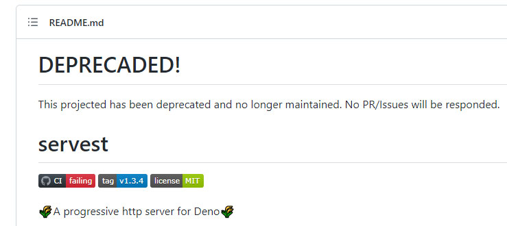
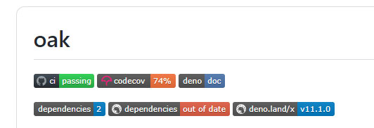
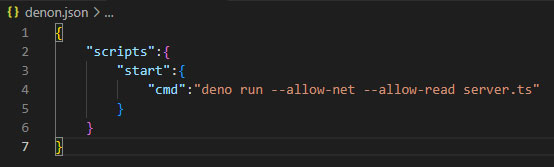
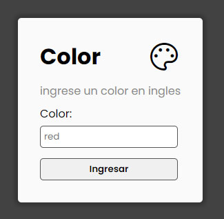
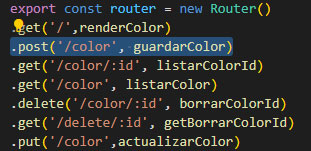
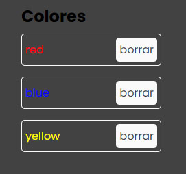

# SERVIDOR EN DENO

**Entrega 24 - Coder House - Backend Node.js**

**Servidor en DENO**


## Iniciar 🐱‍🏍

Para iniciar el servidor, ya no es necesario instalar las dependencias

podemos iniciar el server

```

deno run --allow-net --allow-read server.ts

```

O

```

denon start

```

## Descripción 📑

El proyecto consta de las siguientes consignas:

**Consigna 1 - 📣**

➔ Crear un servidor que utilice el módulo http servest y genere la vista con React render.

🎯 **Solución**

Lastimosamente Serverst, se encuentra deprecado y ya no funciona.

[Link a Serverst](https://github.com/keroxp/servest)



Pero se realizo con la tecnología recomendada que es OAK.



[Link a OAK](https://deno.land/x/oak@v11.1.0)

y para las vistas, se utilizo EJS.

**Consigna 2 - 📣**

➔ Configurar denon para que, ante un cambio de código, el servidor se reinicie automáticamente.

🎯 **Solución**

Se crea el archivo de configuración de denon.



**Consigna 3 - a 📣**

➔ El servidor presentará en su ruta raíz un formulario de ingreso de un color, que será enviado al mismo por método post. Dicho color (en inglés) será incorporado a un array de colores persistido en memoria.

🎯 **Solución**

**Formulario de carga de color**



Rutas del servidor, además de las rutas necesarias, se agregaron las rutas, básicas, para realizar pruebas de CRUD.



**Consigna 3 - b 📣**

Por debajo del formulario se deberán representar los colores recibidos en una lista desordenada (ul) utilizando el mismo color para la letra en cada caso. El color de fondo del la vista será negro.

🎯 **Solución**

Se muestran los resultados en forma de lista ul, formateado con css y además, se le agrego un botón de eliminar, para agregar mas dinamismo



## Que aprendí ? 💡

En este modulo se aprendió a utilizar otra herramienta de desarrollo llamada **Deno**, una herramienta potente, creada como evolución de NODE.

Es una herramienta potente, enfocada en el uso de las características de _ES6_ y **promesas**

Mejoras, como el uso de dependencias, sin necesidad de descargarlas.

Uso de TS, usa **typescript**, el cual le da mas fortaleza al codigo.

Gestiona permisos, lo que hace que el sistema sea mucho mas **seguro**.

## Tecnologías 💾

**Deno:** Como plataforma de desarrollo.

**Oak:** Se utiliza para gestión de rutas y para el manejo del servidor.

**ViewEngine:** para renderizar las vistas.

**Dotenv:** para el manejo del archio .ENV y las configuraciones.

⚡ **Author : Teresczuk Gabriel**
