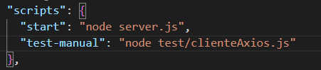
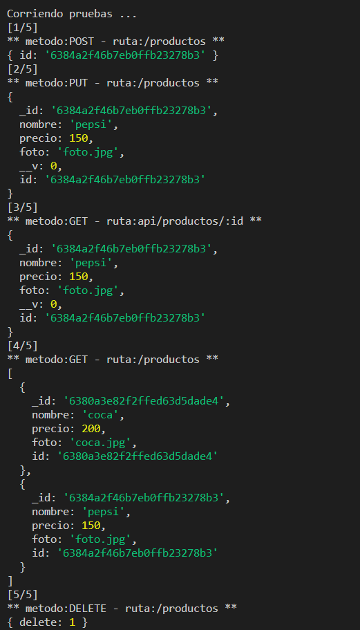
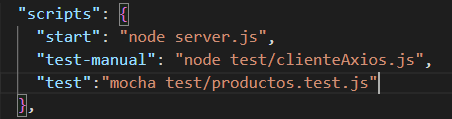
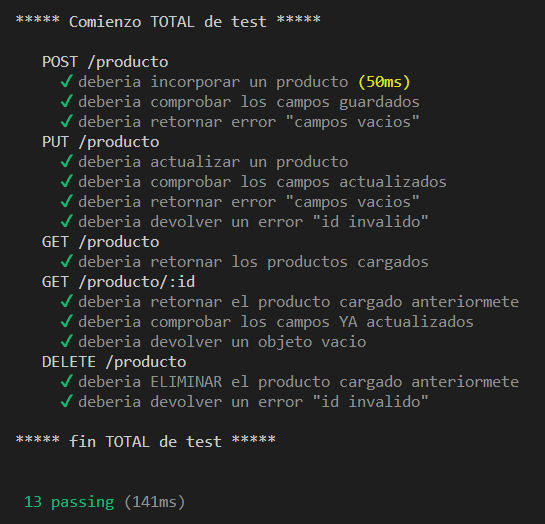

# TESTEAMOS NUESTRA API REST

**Entrega 21 - Coder House - Backend Node.js**

**Testeamos nuestra api rest**


## Iniciar 🐱‍🏍

Para iniciar el servidor, primero instalar las dependencias

```
npm install
```

luego podemos iniciar el server

```
node start --p PUERTO --m MODO --db DATABASE
```

O

```
node server.js --p PUERTO --m MODO --db DATABASE
```

## Descripción 📑

El proyecto consta de las siguientes consignas:

**Consigna 1 - 📣**

➔ Desarrollar un cliente HTTP de pruebas que utilice Axios para enviar peticiones, y realizar un test de la funcionalidad hacia la API Rest de productos, verificando la correcta lectura de productos disponibles, incorporación de nuevos productos, modificación y borrado.

➔ Realizar el cliente en un módulo independiente y desde un código aparte generar las peticiones correspondientes, revisando los resultados desde la base de datos y en la respuesta del servidor obtenida en el cliente HTTP.

🎯 **Solución**

Se setea el script para correr las pruebas manuales en un archivo auto ejecutable asincrónico.



```
npm run test-manual
```

Se realizan las pruebas en la ruta "/producto", cada una verificando en la base de datos.



Se trabaja con un solo ID, que es el mismo que se modifica y al final de la prueba es eliminado, para no dejar residuos de datos en la base.

**Consigna 2 - 📣**

➔ Luego, realizar las mismas pruebas, a través de un código de test apropiado, que utilice mocha, chai y Supertest, para probar cada uno de los métodos HTTP de la API Rest de productos.

➔ Escribir una suite de test para verificar si las respuestas a la lectura, incorporación, modificación y borrado de productos son las apropiadas. Generar un reporte con los resultados obtenidos de la salida del test.

🎯 **Solución**

Se realiza el script para las pruebas automáticas con mocha, chai y supertest



```
npm run test
```

Se realizan diversas pruebas, con la misma idea de trabajar sobre un mismo documento, modifiandolo y eliminando

Al ser mas compacto el test y poder comparar valores, se agregaron mas test, en caso de insertar campos vacíos y retorno de errores.



**_Se pueden notar los beneficios de utilizar los test automáticos, la practicidad al momento de escribirlos, la facilidad de comparar los valores devueltos, como podemos empaquetar funcionalidades dentro un de "describe" y enumerarlos con el "it", además de esto, visualmente queda mucho mas ameno._**

## Que aprendí ? 💡

**Solicitudes http:**
En este module aprendí a realizar solicitudes http desde node, sin necesidad de algún programa externo como postman o imsomnia

**Testeo del servidor:**
Diferentes practicas para la escritura del código, basandonos en TDD o BDD.
Para luego se probadas, de manera manual y mucho mejor de forma automática.

## Tecnologías 💾

En este proyectos, se utilizaron distintas tecnologías:

- Node.js : entorno de tiempo de ejecución - RTE.

- Express.js: framework para Node y manejo de rutas.

- http y socket.io: para la interacción del chat.

- faker-js: para realizar mocks de datos.

- normalizr: necesario para normalizar los datos.

- moongose: realiza la conexión con la base de datos mongodb.

- mongodb: para la persistencia de datos.

- express-session: para manejar las sessiones

- Mongo Atlas: para la persistencia de datos en la nube.

- EJS: como motor de plantillas.

- bCrypt: como api de encriptación.

- passport: para la gestión de autenticaciones.

- passport-local: como estrategia local junto con passport.

- dotenv : libreria necesaria para cargar al process las variables del archivo .env

- minimalist : permite gestionar los argumentos pasados a la ejecucion del servidor

- cluster : es un modulo de Node, que nos permite crear copias del servidor para delegar carga a cada procesador.

- forever : es un modulo que nos permite correr nuestro servidor y actualizarlo sin necesidad de recargar (parecido a nodemon, pero para produccion)

- PM2 : es un gestor de procesos, el cual nos permite dentro de sus funcionalidad clustear nuestro servidor de forma automatica.

- Nginx: es un servidor web, como apache pero con mas funcionalidades, en este caso lo utilizamos como proxy

- compression: libreria para comprimir contenido antes de enviarlo al cliente.

- winston: es un modulo que permite loggear de manera asincronica, tanto en consola como en archivos.

- artillery: es una herramienta que permite realizar pruebas de carga de nuestra aplicaciones

- autocannon: es otra herramienta de prueba de cargas para aplicaciones y servidores.

- **Axios:** biblioteca de solicitudes .
- **Mocha:** framework de pruebas para node.
- **Supertest:** prueba solicitudes http.
- **Chai:** es una libreria que sirve para comparar valores.

⚡ **Author : Teresczuk Gabriel**
